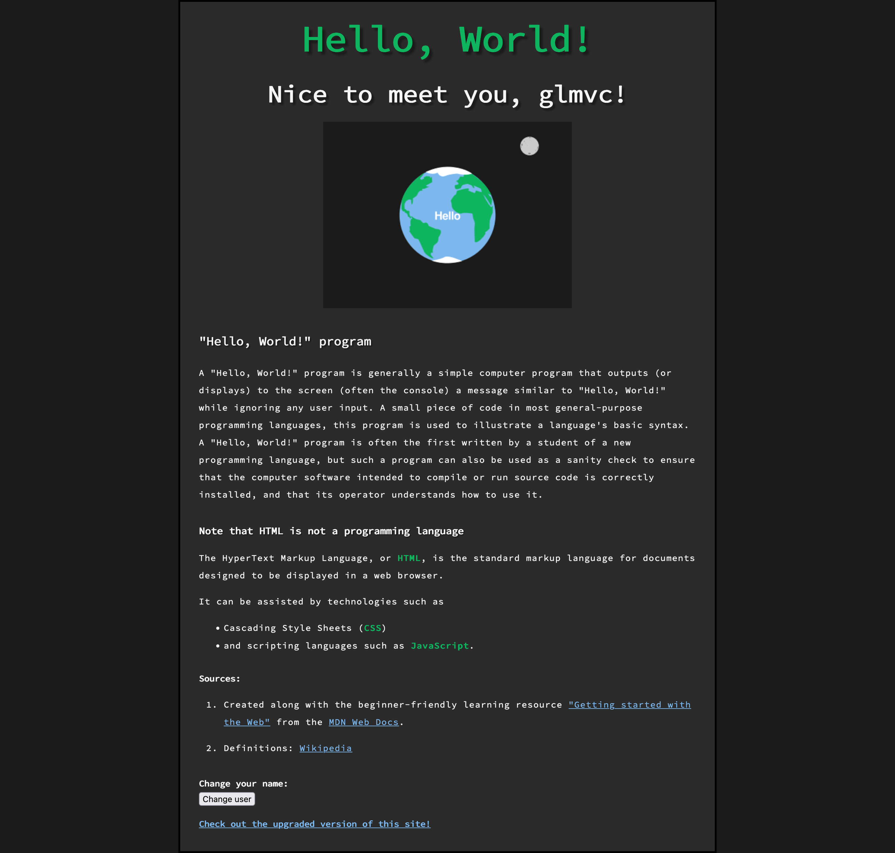

# 🌐 first-site

## 🚀 i started my journey as a web developer with this small website project

### 🌱 this should be an *inspiration* and *resource* for anyone looking to get into web development

- just try to build your very first website, step by step 👷‍♀️
- and learn the first important fundamentals of web development right away 🧑‍🔬
- also, don't be shy and show us your result 👨‍💻
- we're all here to learn from and with others, no matter how advanced someone is 🐣

#### 👀 check out what is possible with 1-3 hours of research and motivation

- the site has content (with hyperlinks) 📰
- it's styled 🎨
- clicking on the image will show another one 🖼️
- the user is asked for a name, which is displayed under the main heading and can also be changed by clicking the button 🪄
- the website is online using [github pages](https://pages.github.com/ "github pages website") 🌎

##### 🔗 [first-site](https://glmvc.github.io/first-site/ "first-site website")

[](https://glmvc.github.io/first-site/)

#### 🔮 i've created an **upgraded version** of this website - give the upgraded project a chance and check it out

- spoiler: it's *way* better and can do *much* more 🦾
- [upgraded repository](https://github.com/glmvc/first-site-upgrade "first-site-upgrade github repository")
- [upgraded website](https://glmvc.github.io/first-site-upgrade/ "first-site-upgrade website")

---

#### 👾 and here are the lines of code for my first-site

- as a complete beginner, the following just looks impressive - i was surprised myself at what i achieved 🤩
- but you'll see, once you get started, it's not that difficult at all ⚡️

##### HTML

``` html
<!DOCTYPE html>
<html>
    <head>
        <meta charset="utf-8">
        <title>My First Site</title>
        <link href="https://fonts.googleapis.com/css?family=Source+Code+Pro" rel="stylesheet">
        <link href="styles/main.css" rel="stylesheet">
    </head>
    <body>
        <h1>hello world!</h1>
        <h2>Nice to meet you!</h2>
        
        <h3>"Hello, World!" program</h3>
        <p>A "Hello, World!" program is generally a simple computer program that outputs (or displays) to the screen (often the console) a message similar to "Hello, World!" while ignoring any user input. A small piece of code in most general-purpose programming languages, this program is used to illustrate a language's basic syntax. A "Hello, World!" program is often the first written by a student of a new programming language, but such a program can also be used as a sanity check to ensure that the computer software intended to compile or run source code is correctly installed, and that its operator understands how to use it.</p>
        <h4>Note that HTML is not a programming language</h4>
        <p>The HyperText Markup Language, or <strong>HTML</strong>, is the standard markup language for documents designed to be displayed in a web browser.</p>
        <p>It can be assisted by technologies such as</p>
        <ul>
            <li>Cascading Style Sheets (<strong>CSS</strong>)</li>
            <li>and scripting languages such as <strong>JavaScript</strong>.</li>
        </ul>
        <h5>Sources:</h5>
        <ol>
            <li>
                <p>Created along with the beginner-friendly learning resource <a href="https://developer.mozilla.org/en-US/docs/Learn/Getting_started_with_the_web">"Getting started with the Web"</a> from the <a href="https://developer.mozilla.org/en-US/">MDN Web Docs</a>.</p>
            </li>
            <li>
                <p>Definitions: <a href="https://wikipedia.org/">Wikipedia</a></p>
            </li>
        </ol>
        <h6>Change your name:</h6>
        <button>Change user</button>
        <a href="https://glmvc.github.io/first-site-upgrade/"><h6>Check out the upgraded version of this site!</h6></a>
        <script src="scripts/main.js"></script>
    </body>
</html>

```

##### CSS

```css
/* i am a comment (a browser ignores comments as it renders the code) */

html {
    font-size: 10px; /* px means "pixels": the base font size is now 10 pixels */
    font-family: "Source Code Pro", monospace; /* from google fonts */
    color: whitesmoke;
    background-color: #1A1A1A;
}

h1 {
    font-size: 60px;
    text-align: center;
}

p, li {
    font-size: 14px;
    line-height: 2;
    letter-spacing: 1px;
}

body {
    width: 800px; /* forces the body to always be 800px */
    margin: 0 auto; /* first value: top & bottom; second value: left & right (2 values order) */
    background-color: #2B2B2B;
    padding: 0 30px 30px 30px; /* 4 values order: top, right, bottom, left = clockwise (for margin the same logic) */
    border: 3px solid black; /* values for: width, style and color of the border */
}

h1 {
    color: #0FB55E;
    margin: 0; /* 1 value order: all four sides */
    padding: 20px 0 5px; /* 3 values order: top, right & left, bottom */
    text-shadow: 5px 5px 3px #1A1A1A; /* 1. horizontal offset; 2. vertical offset; 3. blur radius 4. color */
}

h2 {
    font-size: 40px;
    text-align: center;
    margin: 0;
    padding: 20px 0 20px;
    text-shadow: 4px 4px 2px #1A1A1A;
}

h3 {
    font-size: 20px;
    margin: 0;
    padding: 40px 0 10px;
    text-shadow: 2px 2px 1px #1A1A1A;
}

h4 {
    font-size: 16px;
    margin: 0;
    padding: 20px 0 5px;
    text-shadow: 1.5px 1.5px 0.5px #1A1A1A;
}

h5, h6 {
    font-size: 14px;
    margin: 0;
    padding: 20px 0 5px;
}

img {
    display: block; /* images are inline elements - give them block-level behavior to make the auto margin trick working */
    margin: 0 auto;
}

a {
    color: #7CB7ED;
}

a:hover {
    color: #0FB55E;
}

strong {
    color: #0FB55E;
}

```

##### JS

```javascript
/* i am a comment
   (a browser ignores text marked as comments) */
// i am a single line comment

const correctedHeading = document.querySelector('h1');
correctedHeading.textContent = 'Hello, World!';


document.querySelector('h1').onclick = function() {
    alert('Ouch! Stop poking me!');
}

/* alternative (longer) code:
let myHeadline1 = document.querySelector('h1');
myHeadline1.onclick = function() {
    alert('Ouch! Stop poking me!');
}
*/


// image switcher code:

let myImage = document.querySelector('img');

myImage.onclick = function() {
  let mySrc = myImage.getAttribute('src');
  if(mySrc === 'images/hello-world.png') {
    myImage.setAttribute ('src','images/js-code.png');
  } else {
    myImage.setAttribute ('src','images/hello-world.png');
  }
}


// personalized welcome message code:

let myButton = document.querySelector('button');
let myHeading = document.querySelector('h2');

function setUserName() {
    let myName = prompt('Please enter your name.');
    if(!myName) {
        setUserName();
    } else {
        localStorage.setItem('name', myName);
        myHeading.textContent = 'Nice to meet you, ' + myName + '!';
    }
}

if(!localStorage.getItem('name')) {
    setUserName();
} else {
    let storedName = localStorage.getItem('name');
    myHeading.textContent = 'Nice to meet you, ' + storedName + '!';
}

myButton.onclick = function() {
    setUserName();
}

```

---

> created along with the beginner-friendly learning resource ["getting started with the web"](https://developer.mozilla.org/en-US/docs/Learn/Getting_started_with_the_web "getting started with the web article on mdn") from the [mdn web docs](https://developer.mozilla.org/ "mdn web docs website")
